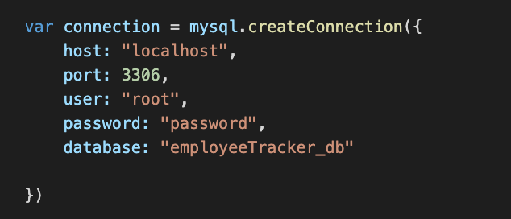
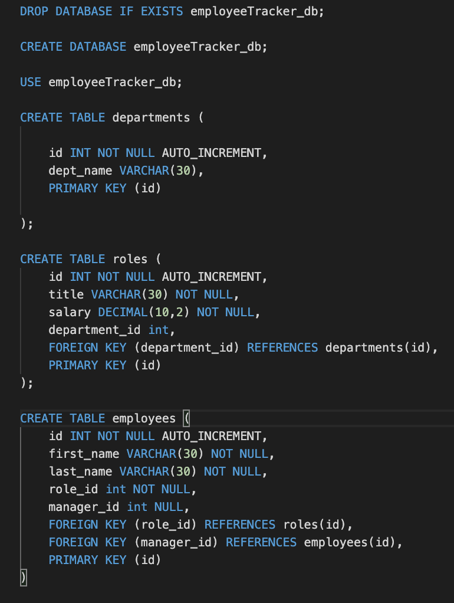
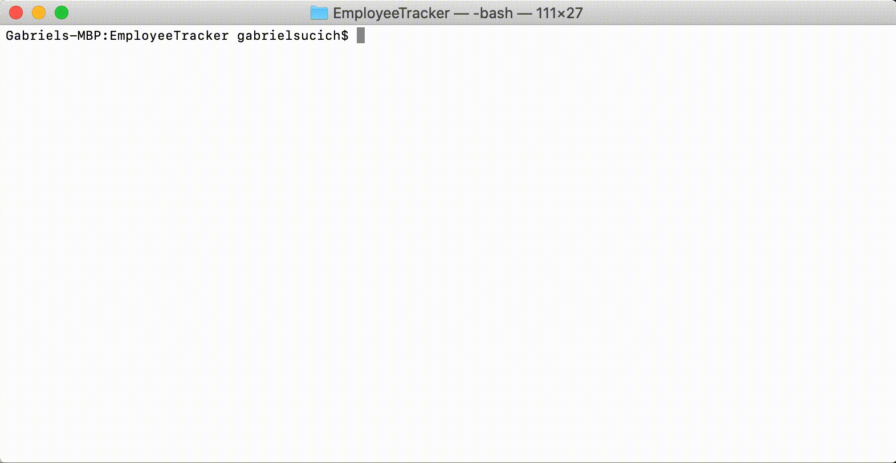

# EmployeeTracker

In the world of business, the ability to keep track of a company's employees, departments, work roles, and chains of command is an invaluable. This command-line interface application enables users to access and manage a large database containing this information about their own companies. Users can view all of the employees in their companies, or look up the employees listed under specified departments or titles. New departments can be created from the CLI, as well as roles under these departments and employees holding these roles. Additionally, the roles of employees can be updated if their position in the company changes.

This application employs the mySQL database npm package for data storage, and the inquirer npm package to power the CLI.

## Contents

* [Installing](#installing)
* [Built With](#built-with)
* [Application Functionality](#application-functionality)
* [Developer Information](#gabriel-sucich)

## Installing

To access code for use or development, clone the Github repository onto your local machine using:

```
git clone https://github.com/GabeSucich/EmployeeTracker.git
```

To download the necessary dependencies, navigate into the cloned directory and enter the following in terminal:

```
npm install
```

## Getting Stared With mySQL

This application runs of a locally-hosted mySQL database. [Download the mySQL workbench](https://www.mysql.com/products/workbench/) and instantiate an instance. Change the port number in the `emloyee_db.js` file below to the port number of your instance if it is not 3306:



Then, copy and paste the code in the `seed.sql` file into your workbench and run it so you can access the databases from your CLI application:



## Built With

* [Javascript](https://developer.mozilla.org/en-US/docs/Web/JavaScript)
* [Inquirer](https://www.npmjs.com/package/inquirer)
* [mySQL](https://www.npmjs.com/package/mysql)

## Application Functionality

Users can view all employees, or view employees by role/department:



Users can add new departments, roles, and employees to their database:


Users can update the roles of employees:


### Gabriel Sucich


- [Portfolio](https://gabesucich.github.io/UpdatedPortfolio/)
- [Github](https://github.com/GabeSucich)
- [LinkedIn](www.linkedin.com/in/gabriel-sucich-6a28a71a8)

See also the list of any other [contributors](https://github.com/GabeSucich/EmployeeTracker/contributors) who on this project.